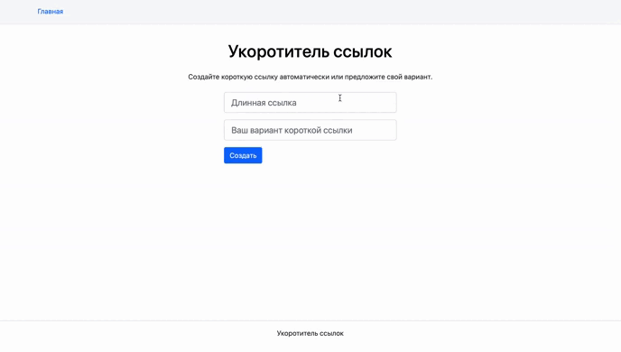

# Проект URL-Shortener

## Примеры запросов к API описаны в файле спецификации `openapi.yml`.

## Запустить в Docker

```
docker build -t flask-app .
```
```
docker run -it --rm -p 5000:5000 flask-app
```

Проект будет доступен по адресу <b>127.0.0.1:5000</b>

## Запуск

Клонировать репозиторий и перейти в него в командной строке:

```
git clone git@github.com:PavelHomov/URL-Shortener.git
```

```
cd URL-Shortener
```

Cоздать и активировать виртуальное окружение:

```
python3 -m venv venv
```

* Если у вас Linux/macOS

    ```
    source venv/bin/activate
    ```

* Если у вас windows

    ```
    source venv/scripts/activate
    ```

Установить зависимости из файла requirements.txt:

```
python3 -m pip install --upgrade pip
```

```
pip3 install -r requirements.txt
```

Для запуска проекта не в Docker дополнительно к зависимостям нужно установить greenlet
```
pip3 install greenlet
```

Создать файл .env с переменными окружения. Пример наполнения:
```
FLASK_APP=url_shortener
FLASK_ENV=development
SECRET_KEY= MY_SECRET_KEY
DATABASE_URI=sqlite:///db.sqlite3
```
Создать базу данных:
```
flask db init
flask db migrate
flask db upgrade
Либо вручную через оболочку Flask
```
Запустить сервис на локальном сервере:
```
flask run
```
